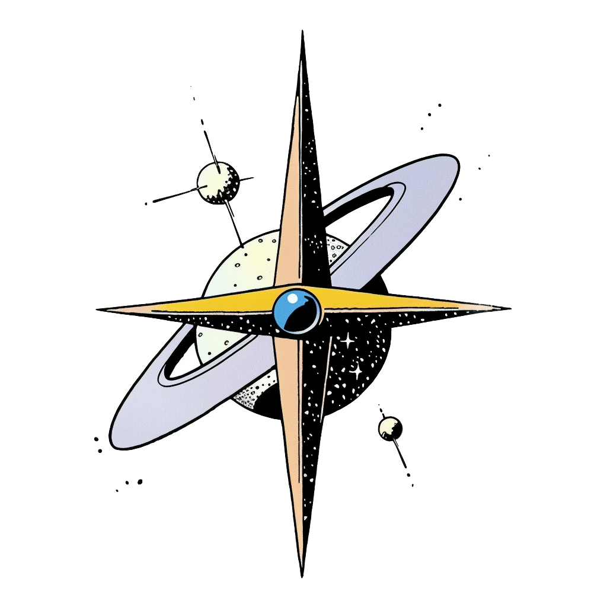

<p align="center">
  
</p>

# OpenYoko

[](LICENSE)
[](https://docs.anthropic.com/claude-code)
[](https://obsidian.md)

A **personal operating system** for intentional living. Structure before automation. Clarity before tools.

---

## What is OpenYoko?

OpenYoko is a framework for organizing your life around what matters:

- **Vision** → Where you're going (5-year horizon)
- **Pillars** → What must never be neglected (10 life areas)
- **Projects** → What you're actively building
- **Reflection** → How you course-correct (daily, weekly, monthly)

It uses plain markdown files, works with Obsidian (or any text editor), and integrates with Claude Code for intelligent assistance.

---

## Quick Start

### Prerequisites

- **Git** - Version control
- **Claude Code** - `npm install -g @anthropic-ai/claude-code`
- **Obsidian** (recommended) - For viewing your vault

### Setup

```bash
# 1. Clone the repo
git clone https://github.com/ThoBustos/openyoko.git
cd openyoko

# 2. Run Claude Code
claude

# 3. Start onboarding
```

Then say: **"Let's do it"**

Claude guides you through ~15 minutes of setup:
- Asks about your vision, pillars, and projects
- Creates your vault at `../my-vault/`
- Sets up the folder structure

### 4. Open in Obsidian

Open your new `my-vault/` folder in Obsidian. You're ready.

---

## The Flow

```
┌─────────────────────────────────────────────────────────────┐
│                                                             │
│     /onboarding  →  /monthly  →  /weekly  →  /daily        │
│         ↑                                        ↓          │
│         └────────────── /scan ←──────────────────┘          │
│                                                             │
└─────────────────────────────────────────────────────────────┘
```

**Cadences:**
- `/monthly` - Deep reflection, pillar scores, month planning (60-90 min)
- `/weekly` - Close the week, plan the next (30-45 min)
- `/daily` - Set intention, capture the day (5-10 min)
- `/scan` - Quick health check anytime

*Life goals and Yearly planning skills are planned (pillars + life → yearly → monthly). Not yet implemented.*

**Quick capture:**
- `/update` - Log anything, update relevant files
- `/add-task` - Add tasks to proper locations

---

## Core Skills

| Skill | When | Purpose |
|-------|------|---------|
| `/onboarding` | First time | Create vault, gather vision |
| `/daily` | Morning/evening | Set intention, log reflection |
| `/weekly` | Sunday | Close week, plan next |
| `/monthly` | 1st of month | Deep reflection, pillar scores |
| `/scan` | Anytime | Quick pulse check |
| `/update` | Anytime | Universal quick capture |
| `/add-task` | Anytime | Add task properly |
| `/new-project` | Starting something | Create project structure |

See [Skills Catalog](docs/SKILLS_CATALOG.md) for all skills.

---

## Vault Structure

```
my-vault/
├── 00_SYSTEM/           # Operating system files
│   ├── GLOBAL_STATE.md  # Current focus, active projects
│   ├── LIFE_VISION.md   # 5-year vision
│   ├── PILLARS.md       # 10 life pillars
│   └── TODO.md          # Cross-project tasks
├── 01_GOALS/            # Year and quarter goals
├── 02_JOURNAL/          # Weekly and monthly reflections
├── 03_PROJECTS/         # Active projects
├── 04_PEOPLE/           # Relationship notes
├── 05_WRITING/          # Creative work
└── 06_ARCHIVE/          # Completed projects
```

---

## The 10 Pillars

| Pillar | Question |
|--------|----------|
| Body & Energy | Is my body becoming more powerful, resilient? |
| Spirit & Meaning | Do I feel connected to existence? |
| Mind & Clarity | Is my thinking getting clearer, simpler? |
| Love & Relationships | Are my relationships deepening? |
| Self-Time & Joy | When did I last feel childlike, curious? |
| Creation & Craft | What am I building that didn't exist before? |
| Wealth & Leverage | Is my life becoming more free? |
| Impact & Service | If I disappeared, what would be missing? |
| Media & Personal Brand | Is my worldview being expressed? |
| Exploration & Adventure | When did I last feel awe? |

---

## Architecture

```
your-projects/
├── openyoko/            # Framework (this repo)
│   ├── .claude/skills/  # Skill definitions
│   ├── templates/       # Markdown templates
│   └── docs/            # Documentation
└── my-vault/            # YOUR data (created during onboarding)
    └── (your files)
```

**Separation:** The framework stays public and updateable. Your vault is private.

---

## Documentation

| Guide | Description |
|-------|-------------|
| [Getting Started](docs/GETTING_STARTED.md) | Your first week |
| [Skills Catalog](docs/SKILLS_CATALOG.md) | All available skills |
| [Cadences](docs/CADENCES.md) | Daily, weekly, monthly rituals |
| [Vault Organization](docs/VAULT_ORGANIZATION.md) | Folder structure, naming, Excalidraw |
| [Custom Skills](docs/CUSTOM_SKILLS.md) | Create your own workflows |
| [Philosophy](YOKO_IDENTITY.md) | Why OpenYoko exists |
| [MCP Setup](docs/mcp/README.md) | Google, Linear, Notion integrations |

---

## Optional Integrations

Connect external services for richer functionality:

- **Google Workspace** - Gmail, Calendar, Drive ([setup guide](docs/mcp/google-workspace.md))
- **Linear** - Issue tracking ([setup guide](docs/mcp/linear.md))
- **Granola** - Meeting transcription ([setup guide](docs/mcp/granola.md))

You create your own OAuth apps - credentials stay on your machine.

---

## Philosophy

> Structure before automation. Clarity before tools.

OpenYoko doesn't try to automate your life. It gives you:
- Clear structure to think within
- Regular reflection to course-correct
- Simple tools to maintain the system

No notifications. No urgency theater. Just clarity.

See [YOKO_IDENTITY.md](YOKO_IDENTITY.md) for the full philosophy.

---

## Contributing

Ideas welcome. Open an issue or submit a PR.

When contributing:
- Maintain the calm, minimal tone
- Keep examples neutral (no personal references)
- Document the "why" not just the "what"

---

## License

MIT - Use it, fork it, make it yours.

---

<p align="center">
  <em>Structure before automation. Clarity before tools.</em>
</p>
